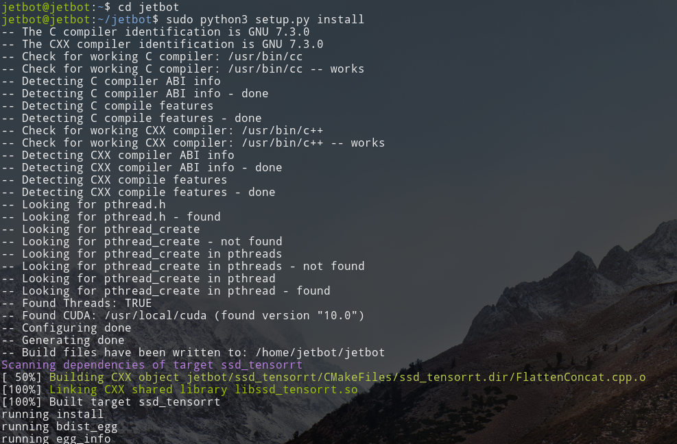
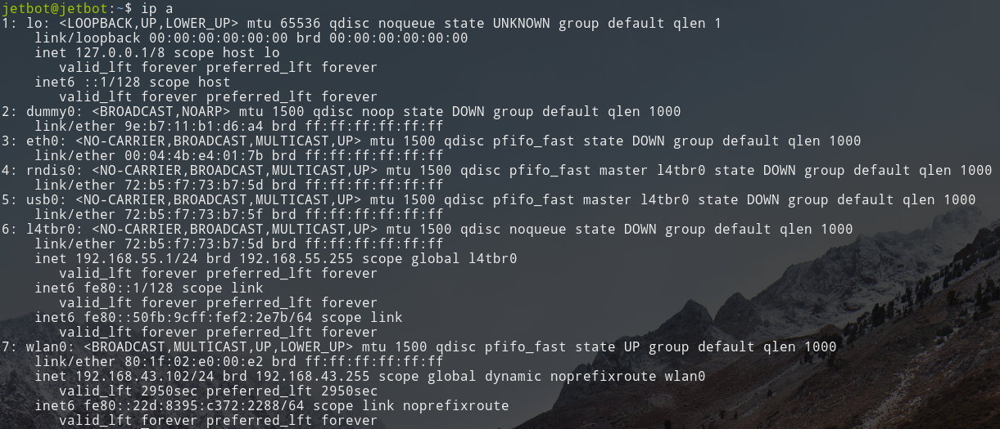
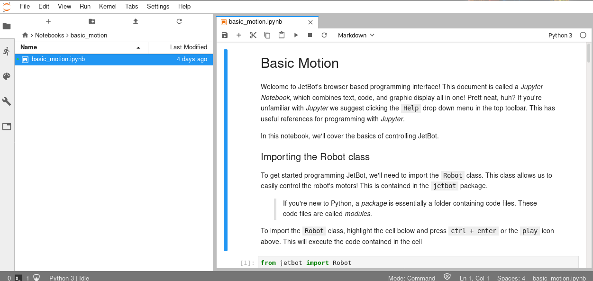
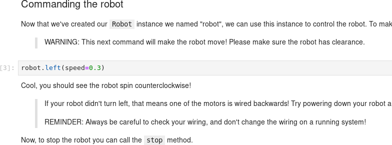
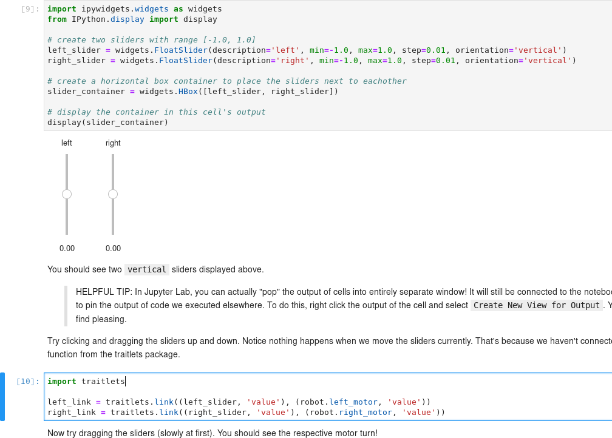
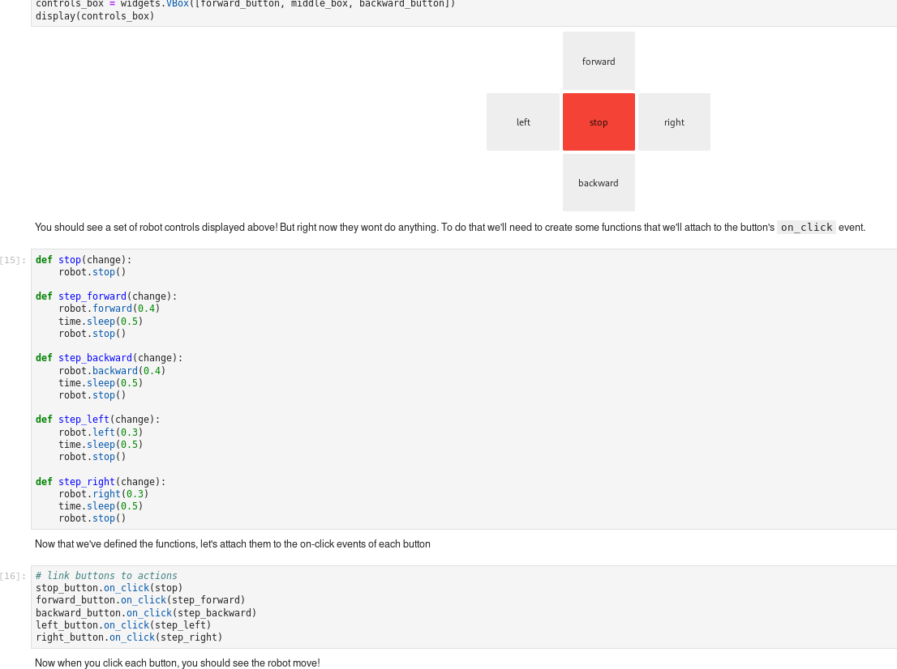
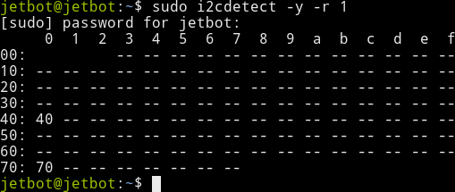
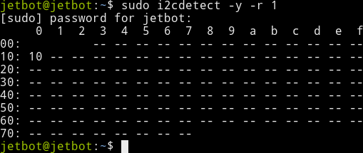

<<<<<<< HEAD
# jetbot
=======
# JetBot (CAVEDU Version)

| 作者 |  JUIN TING KUO |
| ---- | ---|
| 所屬單位  | CAVEDU 教育團隊 |
| 開發日期  | 10909 |
| 文章連結  | https://blog.cavedu.com/2020/09/29/jetbot01/|
            | https://blog.cavedu.com/2020/10/16/jetbot02/|
            | https://blog.cavedu.com/2020/10/26/jetbot03_1/ |
            | https://blog.cavedu.com/2020/12/01/jetbot03_2/ |
            | https://blog.cavedu.com/2020/12/01/jetbot04_1/ |
            | https://blog.cavedu.com/2020/12/01/jetbot04_2/ |
___

## 環境設定

下載本專案

```bash
git clone --branch cave https://github.com/cavedunissin/jetbot.git
```


安裝套件

```bash
cd jetbot
sudo python3 setup.py install
```




為避免Jetson Nano使用過多的電力，我們可以再額外設定Nano的電源管理，改為5W的模式。


```bash
sudo nvpmodel -m1
sudo nvpmodel -q
```


## 馬達驅動板

有別於Jetbot預設支援的驅動板
[Adafruit所推出的馬達驅動板](https://www.adafruit.com/product/2927),
本專案支援馬達驅動板為以下兩款

1. [Waveshare Motor Driver HAT for RPi](https://www.waveshare.com/motor-driver-hat.htm)

2. [DFRobot Motor Driver HAT for RPi](https://wiki.dfrobot.com/DC_Motor_Driver_HAT_SKU_DFR0592)

如要切換使用的馬達驅動板，可以在程式初始化Robot物件時指定，如下(以basic_motion.ipynb為例)

#### 使用DFRobot(預設)


#### 使用Waveshare


## 使用教學

Jetbot專案中有一系列用Jupyter Lab跑的範例，
讓初學者可以透過互動式的界面來學習控制機器人，
為了能夠遠端進入這個界面，我們必須拿到機器人的IP。

請先將Jetbot連接上網路，並打開終端機輸入以下指令

```bash
ip -a
```

如下圖，本範例中的Nano拿到IP是 *192.168.43.102*。




接下來請在電腦上打開瀏覽器，並輸入"IP:8888"，例如在本範例中的"192.168.43.102:8888"，
就會進到以下的登入畫面，密碼預設為"jetbot"。


點選左邊的路徑"Home > Notebooks > basic_motion > basic_motion.ipynb"，就能打開以下的Jupyter Notebook。




使用者可以在程式碼區塊按下快捷鍵"Ctrl+Enter"一步一步的來執行程式。

當執行到第三個區塊時，就可以看到馬達開始動了，
如果沒有，請確認一下有沒有接上電或者是馬達控制板I2C是否有接錯。



執行到第10個區塊時，就可以回到第9個區塊去拉動滑桿，看看能否用滑桿來分別控制兩個馬達的馬力以及正反轉。



執行到第16個區塊時，就可以回到第14個區塊去點選按鈕，看看能否透過按鍵來控制馬達的行為。




## Notebooks_CAVEDU 不同的攝影機使用不同的檔案

在Notebooks_CAVEDU資料夾中在Road following/Collision avoidance範例中修改了程式碼區分使用的攝影機
分別是IMX219跟Logitech C270攝影機
另外範例程式部分也修改為不須使用搖桿即可收集資料之版本


## 疑難雜症

###  如何確認馬達驅動板有沒有正確被偵測到？

可以輸入以下的指令

```bash
sudo i2cdetect -y -r 1
```

Waveshare



DFRobot



>>>>>>> 03a970f (“add”)
